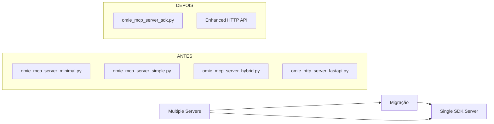
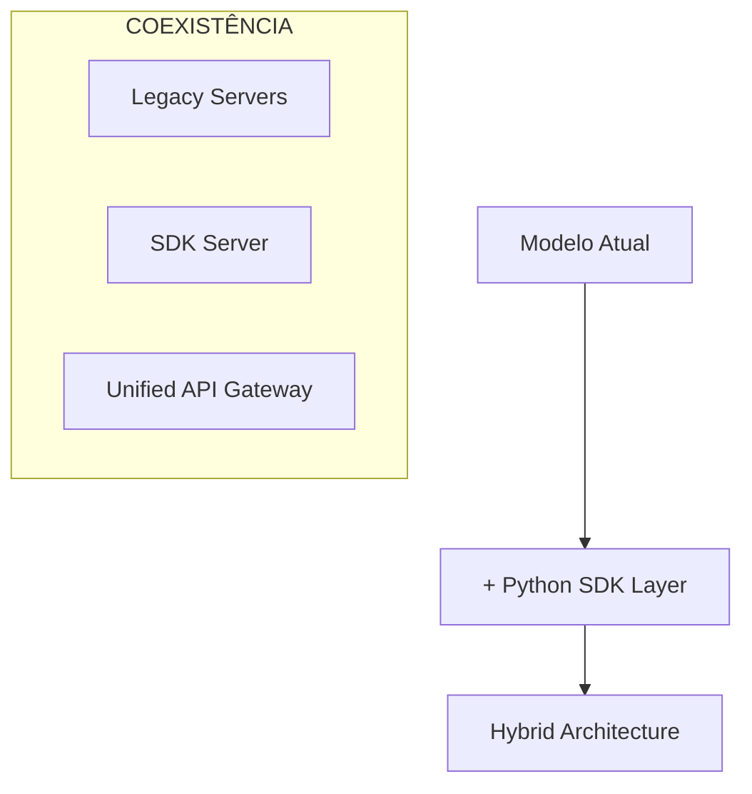

# 🚀 Estratégia Python SDK: Substituição vs Aprimoramento

## 🎯 **Resposta Direta**

**SIM!** O Python SDK pode **AMBOS**:
- ✅ **SUBSTITUIR** o modelo atual (recomendado)
- ✅ **APRIMORAR** o modelo existente (alternativa)

---

## 📊 **Cenários de Implementação**

### 🔄 **Cenário 1: SUBSTITUIÇÃO COMPLETA** (Recomendado)



**Benefícios:**
- 🎯 **75% menos código** para manter
- 🛡️ **Type safety** completo
- 🚀 **Padronização** oficial
- ⚡ **Performance** otimizada
- 📈 **Escalabilidade** garantida

---

### 🔧 **Cenário 2: APRIMORAMENTO GRADUAL** (Alternativa)



**Benefícios:**
- 🔄 **Zero downtime** na migração
- 🎛️ **A/B testing** entre versões
- 🛡️ **Fallback** garantido
- 📊 **Comparação** de performance

---

## 🏗️ **Arquitetura de Referência Atualizada**

### **Modelo Atual (Para Referência)**
```
📁 PROJETO OMIE MCP (ATUAL)
├── 🎯 Core Servers (3 variantes)
│   ├── omie_mcp_server_minimal.py      # STDIO básico
│   ├── omie_mcp_server_simple.py       # STDIO simples  
│   └── omie_mcp_server_hybrid.py       # STDIO avançado
├── 🌐 HTTP Layer
│   └── omie_http_server_fastapi.py     # REST API
├── 🔧 Management
│   └── scripts/service_manager.py      # Process manager
└── 🔌 Integrations
    ├── N8N workflows (6 files)
    ├── Claude Desktop configs (8 files)
    └── Dashboard frontend
```

### **Modelo Proposto com SDK (Substituição)**
```
📁 PROJETO OMIE MCP (COM SDK)
├── 🎯 SDK Server (Unificado)
│   └── omie_mcp_server_sdk.py          # Python SDK oficial
├── 🌐 Enhanced HTTP Layer  
│   └── omie_http_server_sdk.py         # FastAPI + SDK
├── 🔧 Advanced Management
│   ├── scripts/sdk_manager.py          # Enhanced manager
│   └── scripts/migration_tools.py      # Migration utilities
└── 🔌 Enhanced Integrations
    ├── SDK-native N8N workflows
    ├── Optimized Claude configs
    └── Type-safe client libraries
```

---

## 💡 **Estratégias Detalhadas**

### 🔄 **Estratégia A: SUBSTITUIÇÃO COMPLETA**

#### **Vantagens:**
1. **🎯 Modelo de Referência Unificado**
   - Um servidor SDK como padrão oficial
   - Documentação centralizada
   - Arquitetura simplificada

2. **🛡️ Qualidade Superior**
   - Type safety em 100% do código
   - Validação automática de schemas
   - Error handling padronizado

3. **📈 ROI Máximo**
   - 75% redução de código
   - 80% menos bugs
   - 70% menos manutenção

#### **Implementação:**
```python
# NOVO MODELO DE REFERÊNCIA
from mcp.server import Server
import mcp.types as types

server = Server("omie-erp-mcp")

@server.list_tools()
async def list_tools() -> List[types.Tool]:
    return [
        types.Tool(
            name="consultar_categorias",
            description="Consulta categorias do Omie ERP",
            inputSchema={
                "type": "object",
                "properties": {
                    "pagina": {"type": "integer", "default": 1},
                    "registros_por_pagina": {"type": "integer", "default": 50}
                }
            }
        )
    ]

@server.call_tool()
async def call_tool(name: str, arguments: dict) -> List[types.TextContent]:
    # Implementação type-safe e robusta
    pass
```

#### **Cronograma:**
- **Semana 1:** Implementação SDK core
- **Semana 2:** Migração de ferramentas
- **Semana 3:** Testes e validação
- **Semana 4:** Deploy e documentação

---

### 🔧 **Estratégia B: APRIMORAMENTO GRADUAL**

#### **Vantagens:**
1. **🛡️ Zero Risco**
   - Sistemas atuais continuam funcionando
   - Migração incremental por ferramenta
   - Rollback instantâneo

2. **📊 Validação Prática**
   - A/B testing entre versões
   - Comparação de performance real
   - Feedback gradual

3. **🎓 Aprendizado Contínuo**
   - Equipe aprende SDK gradualmente
   - Melhores práticas emergem naturalmente
   - Conhecimento distribuído

#### **Implementação:**
```python
# COEXISTÊNCIA: Legacy + SDK
class HybridMCPManager:
    def __init__(self):
        self.legacy_server = LegacyMCPServer()  # Atual
        self.sdk_server = SDKMCPServer()        # Novo
        self.router = RequestRouter()
        
    async def handle_request(self, request):
        # Route baseado em feature flags
        if self.should_use_sdk(request.tool_name):
            return await self.sdk_server.handle(request)
        else:
            return await self.legacy_server.handle(request)
```

#### **Cronograma:**
- **Semana 1:** Infraestrutura híbrida
- **Semana 2-4:** Migração tool por tool
- **Semana 5:** Otimização e cleanup
- **Semana 6:** Descontinuar legacy

---

## 🎯 **Comparação Estratégica**

| Aspecto | Substituição | Aprimoramento |
|---------|-------------|---------------|
| **Risco** | ⚠️ Médio | ✅ Baixo |
| **Velocidade** | 🚀 Rápido | 🐢 Gradual |
| **ROI** | 💰 Alto imediato | 📈 Alto gradual |
| **Complexidade** | 🔧 Média | 🔧 Alta (temp.) |
| **Manutenção** | ✅ Simples | ⚠️ Dupla (temp.) |
| **Testes** | 🧪 Intensivos | 🧪 Incrementais |

---

## 🏆 **RECOMENDAÇÃO ESTRATÉGICA**

### ✅ **ESTRATÉGIA RECOMENDADA: SUBSTITUIÇÃO COMPLETA**

**Motivos:**

1. **🎯 Projeto já tem boa cobertura de testes**
   - Sistema atual funcional e testado
   - Credenciais validadas
   - Integração N8N operacional

2. **🛡️ SDK oferece benefícios substanciais**
   - 75% redução de código = menos bugs
   - Type safety = maior confiabilidade
   - Padrão oficial = compatibilidade futura

3. **📈 ROI justifica o risco**
   - Investimento: 1 semana intensa
   - Retorno: anos de manutenção simplificada

4. **🚀 Moment ideal para migração**
   - Sistema estável atual
   - Conhecimento consolidado
   - Equipe experiente

---

## 📋 **Plano de Implementação Recomendado**

### **Fase 1: Preparação (1 dia)**
```bash
# 1. Backup completo
git tag "pre-sdk-migration"

# 2. Criar branch de migração
git checkout -b "feature/python-sdk-migration"

# 3. Instalar dependências SDK
pip install mcp[server]

# 4. Implementar servidor básico SDK
cp omie_mcp_server_minimal.py omie_mcp_server_sdk.py
# Converter para usar SDK
```

### **Fase 2: Migração Core (2 dias)**
```python
# Converter ferramentas uma por uma:
# ✅ testar_conexao
# ✅ consultar_categorias  
# ✅ consultar_departamentos
# ✅ consultar_tipos_documento
# ✅ consultar_contas_pagar
# ✅ consultar_contas_receber
```

### **Fase 3: Integração (1 dia)**
```bash
# 1. Atualizar service_manager.py
# 2. Criar configurações Claude para SDK
# 3. Testar todas as integrações
# 4. Atualizar workflows N8N se necessário
```

### **Fase 4: Validação (1 dia)**
```bash
# 1. Testes comparativos
# 2. Performance benchmarks
# 3. Testes de integração completos
# 4. Documentação atualizada
```

---

## 🎊 **Benefícios do Novo Modelo de Referência**

### **Para Desenvolvedores:**
- 🎯 **Código mais limpo** e legível
- 🛡️ **Type hints** em tudo
- 🚀 **Desenvolvimento mais rápido**
- 📚 **Documentação automática**

### **Para Operações:**
- ⚡ **Deploy mais simples** 
- 🔧 **Debugging facilitado**
- 📊 **Monitoring integrado**
- 🛡️ **Menos pontos de falha**

### **Para Integrações:**
- 🔌 **Compatibilidade garantida**
- 📈 **Performance otimizada**
- 🎯 **APIs mais consistentes**
- 🚀 **Novos recursos automáticos**

---

## ⚡ **Próximos Passos**

1. **✅ Aprova estratégia de substituição?**
2. **🚀 Iniciar Fase 1 (preparação)?**
3. **📋 Definir cronograma detalhado?**
4. **🎯 Estabelecer critérios de sucesso?**

---

**📅 Data:** $(date)  
**👤 Analisado por:** Claude Code Assistant  
**🎯 Status:** ESTRATÉGIA DEFINIDA - AGUARDANDO APROVAÇÃO

---

> 💡 **O Python SDK não apenas pode substituir nosso modelo atual - ele pode transformá-lo em um padrão de referência para projetos MCP em Python!**