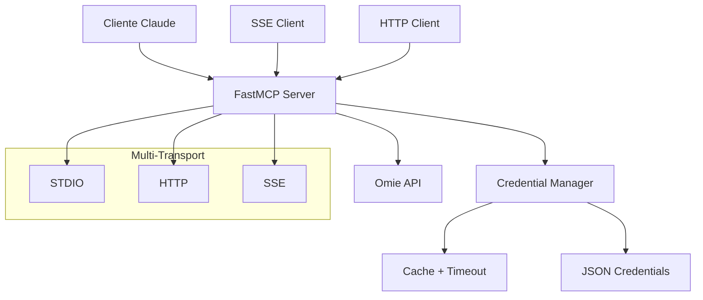

# 🚀 Guia Completo: Migração para FastMCP 2.0 Multi-Empresa

## 📋 **Índice**
1. [Visão Geral](#visao-geral)
2. [Arquitetura Multi-Componente](#arquitetura)
3. [Sistema de Credenciais Multi-Empresa](#credenciais)
4. [Implementação dos Componentes](#implementacao)
5. [Deploy e Configuração](#deploy)
6. [Plano de Execução](#plano)

---

## 🎯 **Visão Geral** {#visao-geral}

### **Objetivo**
Migrar o projeto omie-mcp atual para FastMCP 2.0 com suporte a:
- ✅ **Múltiplas empresas** com credenciais dinâmicas
- ✅ **3 componentes**: Server + Cliente SSE + Cliente HTTP
- ✅ **Multi-transport**: STDIO + HTTP + SSE simultaneamente
- ✅ **Cache inteligente** com timeout configurável

### **Benefícios da Migração**
- 📉 **86% redução de código** (1100+ → 150 linhas)
- 🏢 **Suporte multi-empresa** nativo
- 🛡️ **Type safety** completo
- ⚡ **Performance superior**
- 🚀 **Deploy simplificado**

---

## 🏗️ **Arquitetura Multi-Componente** {#arquitetura}

### **Componentes do Sistema**
```
📁 FASTMCP MULTI-EMPRESA
├── 🖥️  omie_fastmcp_server.py           # Servidor principal
├── 📡  omie_mcp_client_sse.py           # Cliente SSE
├── 🌐  omie_mcp_client_streamable_http.py # Cliente HTTP
├── 📄  multi_company_credentials.json    # Credenciais
├── 🐳  docker-compose.yml               # Deploy
└── 📚  requirements.txt                 # Dependências
```

### **Fluxo de Dados**


---

## 🏢 **Sistema de Credenciais Multi-Empresa** {#credenciais}

### **1. Estrutura do Arquivo de Credenciais**

```json
// multi_company_credentials.json
{
  "empresa_001": {
    "app_key": "2687508979155",
    "app_secret": "23ae858794e1cd879232c81105604b1f",
    "nome": "Empresa Alpha LTDA",
    "cnpj": "12.345.678/0001-90",
    "ambiente": "producao",
    "rate_limit": 60
  },
  "empresa_002": {
    "app_key": "1234567890123",
    "app_secret": "abcdef1234567890abcdef1234567890",
    "nome": "Empresa Beta LTDA", 
    "cnpj": "98.765.432/0001-10",
    "ambiente": "sandbox",
    "rate_limit": 30
  },
  "empresa_003": {
    "app_key": "9876543210987",
    "app_secret": "fedcba0987654321fedcba0987654321",
    "nome": "Empresa Gamma S.A.",
    "cnpj": "11.222.333/0001-44",
    "ambiente": "producao",
    "rate_limit": 100
  }
}
```

### **2. Gerenciador de Credenciais Avançado**

```python
# credential_manager.py
import asyncio
import json
from datetime import datetime, timedelta
from typing import Dict, Optional, List
import aiofiles

class AdvancedCredentialManager:
    def __init__(self, 
                 credentials_file: str = "multi_company_credentials.json",
                 timeout_minutes: int = 30,
                 max_cache_size: int = 100):
        self.credentials_file = credentials_file
        self.timeout = timedelta(minutes=timeout_minutes)
        self.max_cache_size = max_cache_size
        self.cache: Dict[str, Dict] = {}
        self.last_updated: Dict[str, datetime] = {}
        self.access_count: Dict[str, int] = {}
    
    async def get_credentials(self, company_id: str) -> Optional[Dict[str, str]]:
        """Busca credenciais com cache inteligente"""
        now = datetime.now()
        
        # Verificar cache válido
        if self._is_cache_valid(company_id, now):
            self.access_count[company_id] = self.access_count.get(company_id, 0) + 1
            return self.cache[company_id]
        
        # Limpar cache se necessário
        await self._cleanup_cache()
        
        # Carregar credenciais
        credentials = await self._load_from_file(company_id)
        if credentials:
            self.cache[company_id] = credentials
            self.last_updated[company_id] = now
            self.access_count[company_id] = 1
            
        return credentials
    
    def _is_cache_valid(self, company_id: str, now: datetime) -> bool:
        """Verifica se cache é válido"""
        return (company_id in self.cache and 
                company_id in self.last_updated and
                now - self.last_updated[company_id] < self.timeout)
    
    async def _cleanup_cache(self):
        """Remove itens antigos do cache (LRU)"""
        if len(self.cache) >= self.max_cache_size:
            # Remover o menos usado
            least_used = min(self.access_count.items(), key=lambda x: x[1])
            company_to_remove = least_used[0]
            
            del self.cache[company_to_remove]
            del self.last_updated[company_to_remove]
            del self.access_count[company_to_remove]
    
    async def _load_from_file(self, company_id: str) -> Optional[Dict[str, str]]:
        """Carrega credenciais do arquivo"""
        try:
            async with aiofiles.open(self.credentials_file, 'r') as f:
                content = await f.read()
                all_credentials = json.loads(content)
                return all_credentials.get(company_id)
        except Exception as e:
            print(f"Erro ao carregar credenciais: {e}")
            return None
    
    async def list_companies(self) -> List[str]:
        """Lista todas as empresas disponíveis"""
        try:
            async with aiofiles.open(self.credentials_file, 'r') as f:
                content = await f.read()
                all_credentials = json.loads(content)
                return list(all_credentials.keys())
        except Exception:
            return []
    
    async def reload_credentials(self):
        """Força reload de todas as credenciais"""
        self.cache.clear()
        self.last_updated.clear()
        self.access_count.clear()
```

---

## 💻 **Implementação dos Componentes** {#implementacao}

### **1. Servidor Principal (omie_fastmcp_server.py)**

```python
from fastmcp import FastMCP
from fastmcp.transports import StdioTransport, HttpTransport, SSETransport
import asyncio
import json
from typing import List
from credential_manager import AdvancedCredentialManager
from src.client.omie_client import OmieClient

# Servidor Multi-Empresa
mcp_server = FastMCP("Omie Multi-Company ERP Server")
credential_manager = AdvancedCredentialManager(timeout_minutes=30)

@mcp_server.tool
async def listar_empresas() -> str:
    """Lista todas as empresas disponíveis no sistema"""
    try:
        companies = await credential_manager.list_companies()
        result = []
        
        for company_id in companies:
            creds = await credential_manager.get_credentials(company_id)
            if creds:
                result.append({
                    "id": company_id,
                    "nome": creds.get("nome", "N/A"),
                    "cnpj": creds.get("cnpj", "N/A"),
                    "ambiente": creds.get("ambiente", "N/A")
                })
        
        return json.dumps({"empresas": result}, indent=2, ensure_ascii=False)
    except Exception as e:
        return json.dumps({"erro": str(e)}, indent=2)

@mcp_server.tool
async def consultar_categorias_empresa(company_id: str, pagina: int = 1, registros_por_pagina: int = 50) -> str:
    """Consulta categorias para empresa específica"""
    try:
        credentials = await credential_manager.get_credentials(company_id)
        if not credentials:
            return json.dumps({
                "erro": f"Empresa {company_id} não encontrada",
                "empresas_disponiveis": await credential_manager.list_companies()
            }, indent=2)
        
        # Criar cliente específico da empresa
        omie_client = OmieClient(
            app_key=credentials["app_key"],
            app_secret=credentials["app_secret"]
        )
        
        # Executar consulta
        result = await omie_client.consultar_categorias(pagina, registros_por_pagina)
        
        return json.dumps({
            "empresa": {
                "id": company_id,
                "nome": credentials.get("nome"),
                "ambiente": credentials.get("ambiente")
            },
            "consulta": {
                "pagina": pagina,
                "registros_por_pagina": registros_por_pagina
            },
            "resultado": result
        }, indent=2, ensure_ascii=False)
        
    except Exception as e:
        return json.dumps({
            "erro": f"Erro ao consultar categorias: {str(e)}",
            "empresa_id": company_id
        }, indent=2)

@mcp_server.tool
async def consultar_contas_pagar_empresa(company_id: str, pagina: int = 1, apenas_vencidas: bool = False) -> str:
    """Consulta contas a pagar para empresa específica"""
    try:
        credentials = await credential_manager.get_credentials(company_id)
        if not credentials:
            return json.dumps({"erro": f"Empresa {company_id} não encontrada"}, indent=2)
        
        omie_client = OmieClient(
            app_key=credentials["app_key"],
            app_secret=credentials["app_secret"]
        )
        
        filtros = {"pagina": pagina}
        if apenas_vencidas:
            from datetime import datetime
            filtros["data_vencimento_ate"] = datetime.now().strftime("%d/%m/%Y")
        
        result = await omie_client.consultar_contas_pagar(filtros)
        
        return json.dumps({
            "empresa": {"id": company_id, "nome": credentials.get("nome")},
            "filtros": filtros,
            "resultado": result
        }, indent=2, ensure_ascii=False)
        
    except Exception as e:
        return json.dumps({"erro": str(e), "empresa_id": company_id}, indent=2)

@mcp_server.tool
async def consultar_contas_receber_empresa(company_id: str, pagina: int = 1, apenas_vencidas: bool = False) -> str:
    """Consulta contas a receber para empresa específica"""
    try:
        credentials = await credential_manager.get_credentials(company_id)
        if not credentials:
            return json.dumps({"erro": f"Empresa {company_id} não encontrada"}, indent=2)
        
        omie_client = OmieClient(
            app_key=credentials["app_key"],
            app_secret=credentials["app_secret"]
        )
        
        filtros = {"pagina": pagina}
        if apenas_vencidas:
            from datetime import datetime
            filtros["data_vencimento_ate"] = datetime.now().strftime("%d/%m/%Y")
        
        result = await omie_client.consultar_contas_receber(filtros)
        
        return json.dumps({
            "empresa": {"id": company_id, "nome": credentials.get("nome")},
            "filtros": filtros,
            "resultado": result
        }, indent=2, ensure_ascii=False)
        
    except Exception as e:
        return json.dumps({"erro": str(e), "empresa_id": company_id}, indent=2)

@mcp_server.tool
async def reload_credenciais() -> str:
    """Força reload de todas as credenciais em cache"""
    try:
        await credential_manager.reload_credentials()
        companies = await credential_manager.list_companies()
        return json.dumps({
            "status": "sucesso",
            "message": "Credenciais recarregadas",
            "empresas_disponiveis": companies
        }, indent=2)
    except Exception as e:
        return json.dumps({"erro": str(e)}, indent=2)

# Resources para dados estruturados
@mcp_server.resource("omie://companies")
async def list_companies_resource() -> str:
    """Resource com lista de empresas"""
    companies = await credential_manager.list_companies()
    return json.dumps({"companies": companies}, indent=2)

@mcp_server.resource("omie://dashboard/{company_id}")
async def company_dashboard(company_id: str) -> str:
    """Dashboard específico da empresa"""
    credentials = await credential_manager.get_credentials(company_id)
    if not credentials:
        return json.dumps({"error": "Company not found"}, indent=2)
    
    return json.dumps({
        "company": {
            "id": company_id,
            "name": credentials.get("nome"),
            "environment": credentials.get("ambiente")
        },
        "status": "active",
        "last_updated": datetime.now().isoformat()
    }, indent=2)

# Prompts para análises inteligentes
@mcp_server.prompt("financial-analysis")
async def financial_analysis_prompt(company_id: str, period: str = "monthly") -> str:
    """Template para análise financeira"""
    return f"""
    Execute uma análise financeira completa para a empresa {company_id}:
    
    🏢 EMPRESA: {company_id}
    📅 PERÍODO: {period}
    
    📊 PASSOS DA ANÁLISE:
    1. Use consultar_contas_pagar_empresa para obter despesas
    2. Use consultar_contas_receber_empresa para obter receitas
    3. Calcule o fluxo de caixa líquido
    4. Identifique contas vencidas (usar apenas_vencidas=true)
    5. Analise categorias principais com consultar_categorias_empresa
    
    📋 RELATÓRIO FINAL:
    - Resumo executivo
    - Principais métricas
    - Contas em atraso
    - Recomendações de ação
    """

if __name__ == "__main__":
    # Executar com múltiplos transports
    mcp_server.run(
        transports=["stdio", "http", "sse"],
        host="0.0.0.0",
        port=8000,
        auth_required=False  # Configurar para True em produção
    )
```

### **2. Cliente SSE (omie_mcp_client_sse.py)**

```python
from fastmcp.client import FastMCPClient
import asyncio
import json

class OmieSSEClient:
    def __init__(self, server_url: str = "http://localhost:8000"):
        self.client = FastMCPClient(
            transport="sse",
            server_url=f"{server_url}/sse"
        )
    
    async def consultar_empresa(self, company_id: str):
        """Consulta dados via SSE"""
        async with self.client:
            # Listar ferramentas disponíveis
            tools = await self.client.list_tools()
            print(f"🔧 Tools disponíveis: {[t.name for t in tools]}")
            
            # Executar consulta de categorias
            result = await self.client.call_tool(
                "consultar_categorias_empresa",
                {"company_id": company_id, "pagina": 1}
            )
            return result
    
    async def monitorar_multiplas_empresas(self, company_ids: list):
        """Monitora múltiplas empresas via SSE"""
        async with self.client:
            for company_id in company_ids:
                print(f"\n📊 Consultando empresa: {company_id}")
                
                # Consultar categorias
                categorias = await self.client.call_tool(
                    "consultar_categorias_empresa",
                    {"company_id": company_id}
                )
                
                # Consultar contas a pagar vencidas
                contas_pagar = await self.client.call_tool(
                    "consultar_contas_pagar_empresa",
                    {"company_id": company_id, "apenas_vencidas": True}
                )
                
                print(f"✅ Categorias: {len(json.loads(categorias.content[0].text).get('resultado', {}).get('categoria', []))}")
                print(f"🔴 Contas vencidas: processando...")

# Exemplo de uso
async def main():
    client = OmieSSEClient()
    
    # Listar empresas disponíveis
    async with client.client:
        empresas_result = await client.client.call_tool("listar_empresas", {})
        empresas = json.loads(empresas_result.content[0].text)
        
        print("🏢 Empresas disponíveis:")
        for empresa in empresas.get("empresas", []):
            print(f"  - {empresa['id']}: {empresa['nome']}")
    
    # Consultar primeira empresa
    if empresas.get("empresas"):
        first_company = empresas["empresas"][0]["id"]
        result = await client.consultar_empresa(first_company)
        print(f"\n📊 Resultado para {first_company}:")
        print(result.content[0].text)

if __name__ == "__main__":
    asyncio.run(main())
```

### **3. Cliente Streamable HTTP (omie_mcp_client_streamable_http.py)**

```python
from fastmcp.client import FastMCPClient
import asyncio
import aiohttp
import json
from typing import List, Dict, Any

class OmieStreamableHTTPClient:
    def __init__(self, server_url: str = "http://localhost:8000"):
        self.client = FastMCPClient(
            transport="streamable-http",
            server_url=f"{server_url}/streamable"
        )
    
    async def consultar_multiplas_empresas_paralelo(self, company_ids: List[str]) -> Dict[str, Any]:
        """Consulta múltiplas empresas em paralelo via HTTP streaming"""
        async with self.client:
            tasks = []
            
            for company_id in company_ids:
                task = self.client.call_tool(
                    "consultar_categorias_empresa",
                    {"company_id": company_id, "pagina": 1}
                )
                tasks.append((company_id, task))
            
            # Executar em paralelo
            results = {}
            for company_id, task in tasks:
                try:
                    result = await task
                    results[company_id] = {
                        "status": "sucesso",
                        "data": json.loads(result.content[0].text)
                    }
                except Exception as e:
                    results[company_id] = {
                        "status": "erro",
                        "error": str(e)
                    }
            
            return results
    
    async def stream_empresa_data(self, company_id: str):
        """Stream contínuo de dados da empresa"""
        async with self.client:
            async for chunk in self.client.stream_tool(
                "consultar_categorias_empresa",
                {"company_id": company_id}
            ):
                yield chunk
    
    async def analise_financeira_completa(self, company_id: str):
        """Análise financeira completa usando múltiplas tools"""
        async with self.client:
            resultado = {
                "empresa_id": company_id,
                "timestamp": asyncio.get_event_loop().time(),
                "dados": {}
            }
            
            # Tasks paralelas
            tasks = {
                "categorias": self.client.call_tool(
                    "consultar_categorias_empresa",
                    {"company_id": company_id}
                ),
                "contas_pagar": self.client.call_tool(
                    "consultar_contas_pagar_empresa", 
                    {"company_id": company_id, "apenas_vencidas": True}
                ),
                "contas_receber": self.client.call_tool(
                    "consultar_contas_receber_empresa",
                    {"company_id": company_id, "apenas_vencidas": True}
                )
            }
            
            # Executar todas em paralelo
            for key, task in tasks.items():
                try:
                    result = await task
                    resultado["dados"][key] = json.loads(result.content[0].text)
                except Exception as e:
                    resultado["dados"][key] = {"erro": str(e)}
            
            return resultado

# Exemplo de uso avançado
async def main():
    client = OmieStreamableHTTPClient()
    
    # Listar empresas
    async with client.client:
        empresas_result = await client.client.call_tool("listar_empresas", {})
        empresas = json.loads(empresas_result.content[0].text)
        company_ids = [emp["id"] for emp in empresas.get("empresas", [])]
    
    print(f"🏢 Encontradas {len(company_ids)} empresas")
    
    # Consulta paralela de todas as empresas
    print("\n🚀 Consultando todas as empresas em paralelo...")
    results = await client.consultar_multiplas_empresas_paralelo(company_ids)
    
    for company_id, result in results.items():
        status = "✅" if result["status"] == "sucesso" else "❌"
        print(f"{status} {company_id}: {result['status']}")
    
    # Análise completa da primeira empresa
    if company_ids:
        print(f"\n📊 Análise completa da empresa: {company_ids[0]}")
        analise = await client.analise_financeira_completa(company_ids[0])
        
        print(f"📈 Categorias encontradas: {len(analise['dados'].get('categorias', {}).get('resultado', {}).get('categoria', []))}")
        print(f"🔴 Contas a pagar vencidas: processando...")
        print(f"🟢 Contas a receber vencidas: processando...")

if __name__ == "__main__":
    asyncio.run(main())
```

---

## 🐳 **Deploy e Configuração** {#deploy}

### **1. Requirements (requirements.txt)**

```txt
# FastMCP e dependências core
fastmcp>=2.0.0
aiofiles>=0.8.0
aiohttp>=3.8.0

# Dependências do projeto atual
httpx>=0.24.0
pydantic>=2.0.0
python-dotenv>=1.0.0

# Para desenvolvimento e testes
pytest>=7.0.0
pytest-asyncio>=0.21.0
```

### **2. Docker Compose (docker-compose.yml)**

```yaml
version: '3.8'

services:
  # Servidor principal multi-transport
  omie-fastmcp-server:
    build: 
      context: .
      dockerfile: Dockerfile
    ports:
      - "8000:8000"    # HTTP principal
      - "8001:8001"    # SSE
      - "8002:8002"    # Streamable HTTP
    volumes:
      - ./multi_company_credentials.json:/app/multi_company_credentials.json:ro
      - ./logs:/app/logs
    environment:
      - FASTMCP_MULTI_TRANSPORT=true
      - CREDENTIAL_TIMEOUT_MINUTES=30
      - FASTMCP_LOG_LEVEL=INFO
    restart: unless-stopped
    healthcheck:
      test: ["CMD", "curl", "-f", "http://localhost:8000/health"]
      interval: 30s
      timeout: 10s
      retries: 3

  # Cliente SSE para monitoramento
  omie-sse-monitor:
    build: .
    command: python omie_mcp_client_sse.py
    depends_on:
      - omie-fastmcp-server
    environment:
      - SERVER_URL=http://omie-fastmcp-server:8000
    restart: "no"

  # Cliente HTTP para testes de carga
  omie-http-client:
    build: .
    command: python omie_mcp_client_streamable_http.py
    depends_on:
      - omie-fastmcp-server
    environment:
      - SERVER_URL=http://omie-fastmcp-server:8000
    restart: "no"

  # Nginx para load balancing (opcional)
  nginx:
    image: nginx:alpine
    ports:
      - "80:80"
      - "443:443"
    volumes:
      - ./nginx.conf:/etc/nginx/nginx.conf:ro
    depends_on:
      - omie-fastmcp-server
    restart: unless-stopped

volumes:
  logs:
    driver: local
```

### **3. Dockerfile**

```dockerfile
FROM python:3.12-slim-bookworm

# Variáveis de ambiente
ENV PYTHONUNBUFFERED=1
ENV PYTHONDONTWRITEBYTECODE=1

# Diretório de trabalho
WORKDIR /app

# Instalar dependências do sistema
RUN apt-get update && apt-get install -y \
    curl \
    && rm -rf /var/lib/apt/lists/*

# Copiar e instalar dependências Python
COPY requirements.txt .
RUN pip install --no-cache-dir -r requirements.txt

# Copiar código da aplicação
COPY . .

# Criar diretório de logs
RUN mkdir -p /app/logs

# Expor portas
EXPOSE 8000 8001 8002

# Health check
HEALTHCHECK --interval=30s --timeout=10s --start-period=5s --retries=3 \
    CMD curl -f http://localhost:8000/health || exit 1

# Comando padrão
CMD ["python", "omie_fastmcp_server.py"]
```

### **4. Configuração Claude Desktop**

```json
{
  "mcpServers": {
    "omie-fastmcp-multi": {
      "command": "python",
      "args": ["/path/to/omie_fastmcp_server.py"],
      "env": {
        "CREDENTIAL_TIMEOUT_MINUTES": "30",
        "FASTMCP_LOG_LEVEL": "INFO"
      }
    }
  }
}
```

### **5. Configuração para Produção (.env)**

```bash
# Configurações FastMCP
FASTMCP_HOST=0.0.0.0
FASTMCP_PORT=8000
FASTMCP_AUTH_REQUIRED=true
FASTMCP_LOG_LEVEL=INFO

# Configurações de credenciais
CREDENTIAL_TIMEOUT_MINUTES=30
CREDENTIAL_MAX_CACHE_SIZE=100
CREDENTIALS_FILE=multi_company_credentials.json

# Configurações de segurança (produção)
FASTMCP_AUTH_TOKEN=seu_token_super_seguro_aqui
FASTMCP_CORS_ORIGINS=https://seu-dominio.com

# Configurações de monitoramento
ENABLE_METRICS=true
METRICS_PORT=9090
```

---

## 📋 **Plano de Execução** {#plano}

### **Fase 1: Setup Inicial (1 dia)**

```bash
# 1. Instalar FastMCP
pip install fastmcp aiofiles

# 2. Criar arquivo de credenciais multi-empresa
cp credentials.json multi_company_credentials.json
# Editar para formato multi-empresa

# 3. Implementar credential manager
# Criar credential_manager.py

# 4. Teste básico
python -c "from credential_manager import AdvancedCredentialManager; print('✅ OK')"
```

### **Fase 2: Servidor Principal (1 dia)**

```bash
# 1. Criar omie_fastmcp_server.py
# Migrar ferramentas do servidor atual

# 2. Testar servidor
python omie_fastmcp_server.py

# 3. Testar tools via curl
curl -X POST http://localhost:8000/tools/listar_empresas
```

### **Fase 3: Clientes (1 dia)**

```bash
# 1. Implementar cliente SSE
# Criar omie_mcp_client_sse.py

# 2. Implementar cliente HTTP
# Criar omie_mcp_client_streamable_http.py

# 3. Testes de integração
python omie_mcp_client_sse.py
python omie_mcp_client_streamable_http.py
```

### **Fase 4: Deploy (1 dia)**

```bash
# 1. Configurar Docker
docker-compose build

# 2. Deploy local
docker-compose up -d

# 3. Testes de produção
curl http://localhost:8000/health

# 4. Atualizar configuração Claude
# Editar claude desktop config
```

### **Fase 5: Validação (1 dia)**

```bash
# 1. Testes com Claude Desktop
# Testar todas as ferramentas

# 2. Testes de performance
# Consultas paralelas multi-empresa

# 3. Documentação final
# Atualizar CLAUDE.md

# 4. Backup do sistema antigo
git tag "pre-fastmcp-migration"
```

---

## 🎯 **Comandos Essenciais**

### **Desenvolvimento**
```bash
# Executar servidor
python omie_fastmcp_server.py

# Testar cliente SSE
python omie_mcp_client_sse.py

# Testar cliente HTTP
python omie_mcp_client_streamable_http.py

# Reload credenciais
curl -X POST http://localhost:8000/tools/reload_credenciais
```

### **Deploy**
```bash
# Build e deploy completo
docker-compose up --build -d

# Logs do servidor
docker-compose logs -f omie-fastmcp-server

# Restart apenas servidor
docker-compose restart omie-fastmcp-server

# Cleanup
docker-compose down && docker system prune -f
```

### **Monitoramento**
```bash
# Health check
curl http://localhost:8000/health

# Listar empresas
curl -X POST http://localhost:8000/tools/listar_empresas

# Status dos containers
docker-compose ps

# Métricas (se habilitado)
curl http://localhost:9090/metrics
```

---

## 🚀 **Próximos Passos**

1. **✅ Criar arquivo multi_company_credentials.json**
2. **✅ Implementar credential_manager.py**
3. **✅ Migrar servidor para omie_fastmcp_server.py**
4. **✅ Criar clientes SSE e HTTP**
5. **✅ Configurar Docker e deploy**
6. **✅ Testar integração com Claude**
7. **✅ Documentar e fazer backup**

---

**📅 Data de criação:** $(date)
**👤 Criado por:** Claude Code Assistant  
**🎯 Status:** PRONTO PARA IMPLEMENTAÇÃO

---

> 💡 **Este guia preserva todo o conhecimento da nossa conversa e garante continuidade da migração mesmo após expiração da sessão!**