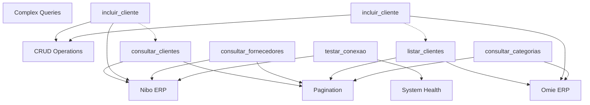

# 🌐 PROPOSTA: ESTRUTURA DE GRAPH PARA BIBLIOTECA MCP

## 🎯 **VISÃO GERAL**

Criar uma estrutura de **grafo de conhecimento** para organizar:
- Documentação de ferramentas MCP
- Relacionamentos entre ERPs
- Dependências entre ferramentas
- Fluxos de integração

## 🏗️ **ARQUITETURA DO GRAPH**

### **1. Nós (Nodes)**

```python
# Tipos de Nós
class NodeType(Enum):
    ERP = "erp"                    # Sistemas ERP
    TOOL = "tool"                  # Ferramentas MCP
    ENDPOINT = "endpoint"          # Endpoints de API
    PARAMETER = "parameter"        # Parâmetros
    WORKFLOW = "workflow"          # Fluxos de trabalho
    CATEGORY = "category"          # Categorias
    TEST_CASE = "test_case"        # Casos de teste
```

### **2. Relacionamentos (Edges)**

```python
class RelationType(Enum):
    BELONGS_TO = "belongs_to"      # Ferramenta → ERP
    DEPENDS_ON = "depends_on"      # Ferramenta → Ferramenta
    CALLS = "calls"                # Ferramenta → Endpoint
    REQUIRES = "requires"          # Ferramenta → Parâmetro
    TESTS = "tests"                # Caso de Teste → Ferramenta
    CATEGORIZED_AS = "categorized_as"  # Ferramenta → Categoria
    PRECEDES = "precedes"          # Fluxo de trabalho
```

### **3. Estrutura Visual**



## 💾 **IMPLEMENTAÇÃO - BANCO DE DADOS GRAPH**

### **Opção 1: Neo4j**
```cypher
// Criar ERPs
CREATE (nibo:ERP {name: 'Nibo', type: 'Financial Management'})
CREATE (omie:ERP {name: 'Omie', type: 'Complete ERP'})

// Criar Categorias
CREATE (crud:Category {name: 'CRUD Operations'})
CREATE (page:Category {name: 'Pagination'})

// Criar Ferramentas
CREATE (consultar_clientes:Tool {
    name: 'consultar_clientes',
    description: 'Consulta clientes com paginação',
    endpoint: '/customers',
    method: 'GET'
})

// Relacionamentos
CREATE (consultar_clientes)-[:BELONGS_TO]->(nibo)
CREATE (consultar_clientes)-[:CATEGORIZED_AS]->(page)
```

### **Opção 2: NetworkX (Python)**
```python
import networkx as nx
from dataclasses import dataclass
from typing import Dict, List

@dataclass
class MCPGraphNode:
    id: str
    type: str
    properties: Dict

class MCPKnowledgeGraph:
    def __init__(self):
        self.graph = nx.MultiDiGraph()
    
    def add_tool(self, tool_doc: ToolDocumentation):
        # Adicionar nó da ferramenta
        self.graph.add_node(
            tool_doc.name,
            type="tool",
            properties=asdict(tool_doc)
        )
        
        # Adicionar relacionamentos
        self.graph.add_edge(
            tool_doc.name, 
            tool_doc.erp, 
            relation="belongs_to"
        )
        
        self.graph.add_edge(
            tool_doc.name, 
            tool_doc.category.value, 
            relation="categorized_as"
        )
    
    def find_similar_tools(self, tool_name: str) -> List[str]:
        """Encontra ferramentas similares baseado no grafo"""
        tool_node = self.graph.nodes[tool_name]
        category = tool_node['properties']['category']
        
        similar = []
        for node, data in self.graph.nodes(data=True):
            if (data['type'] == 'tool' and 
                data['properties']['category'] == category and
                node != tool_name):
                similar.append(node)
        
        return similar
    
    def get_workflow_path(self, start_tool: str, end_tool: str):
        """Encontra caminho de workflow entre ferramentas"""
        try:
            path = nx.shortest_path(self.graph, start_tool, end_tool)
            return path
        except nx.NetworkXNoPath:
            return None
```

## 🔍 **CONSULTAS ESTRUTURADAS**

### **1. Buscar Ferramentas por ERP**
```python
def get_tools_by_erp(graph: MCPKnowledgeGraph, erp_name: str):
    query = f"""
    MATCH (tool:Tool)-[:BELONGS_TO]->(erp:ERP {{name: '{erp_name}'}})
    RETURN tool
    """
    return graph.query(query)
```

### **2. Encontrar Dependências**
```python
def get_dependencies(graph: MCPKnowledgeGraph, tool_name: str):
    query = f"""
    MATCH (tool:Tool {{name: '{tool_name}'}})-[:DEPENDS_ON]->(dep:Tool)
    RETURN dep
    """
    return graph.query(query)
```

### **3. Mapear Fluxo de Trabalho**
```python
def get_crud_workflow(graph: MCPKnowledgeGraph, entity: str):
    """Retorna sequência CREATE → READ → UPDATE → DELETE"""
    operations = ['incluir', 'consultar', 'alterar', 'excluir']
    tools = []
    
    for op in operations:
        tool_name = f"{op}_{entity}"
        if graph.has_node(tool_name):
            tools.append(tool_name)
    
    return tools
```

## 📊 **BENEFÍCIOS DA ESTRUTURA DE GRAPH**

### ✅ **Vantagens**
1. **Consultas Complexas**: Encontrar ferramentas relacionadas facilmente
2. **Análise de Dependências**: Mapear prerequisites automático
3. **Descoberta de Padrões**: Identificar inconsistências entre ERPs
4. **Documentação Visual**: Gerar diagramas automáticos
5. **Teste Inteligente**: Sugerir cenários baseado em relacionamentos

### 🎯 **Casos de Uso**
- **"Quais ferramentas são similares a X?"**
- **"Qual a sequência correta para fazer CRUD de cliente?"**
- **"Que ferramentas preciso testar se altero Y?"**
- **"Quais ERPs têm funcionalidade similar?"**

## 🚀 **IMPLEMENTAÇÃO GRADUAL**

### **Fase 1**: Estrutura Básica (1-2 semanas)
- Modelagem dos nós principais (ERP, Tool, Category)
- Relacionamentos básicos (belongs_to, categorized_as)
- Interface de consulta simples

### **Fase 2**: Enriquecimento (2-3 semanas)
- Adicionar dependências entre ferramentas
- Mapeamento de workflows
- Análise de similaridade

### **Fase 3**: Visualização (1-2 semanas)
- Interface web para explorar o grafo
- Geração automática de diagramas
- Dashboard de métricas

**Esta estrutura transformaria nossa biblioteca de tools em um sistema de conhecimento verdadeiramente inteligente!** 🧠