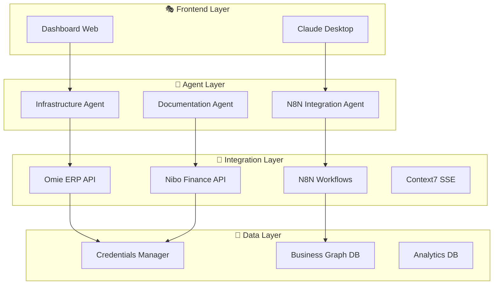

# 🚀 UPTAX - Multi-Agent Business Integration Platform

  

> **Sistema multi-agente para integração de ERPs, automação de workflows e análise financeira em tempo real.**

---

## 📋 **Índice**
- [🎯 Visão Geral](#-visão-geral)
- [🏗️ Arquitetura](#-arquitetura)
- [📱 Aplicações Principais](#-aplicações-principais)
- [🚀 Início Rápido](#-início-rápido)
- [🔧 Instalação](#-instalação)
- [📚 Documentação](#-documentação)
- [🤝 Contribuição](#-contribuição)

---

## 🎯 **Visão Geral**

UPTAX é uma plataforma completa que integra sistemas ERP (Omie, Nibo), automatiza workflows via N8N, e fornece análises inteligentes através de agentes especializados.

### **Características Principais:**
- ✅ **Integração ERP**: Omie + Nibo APIs funcionais
- ✅ **Protocolo MCP**: Integração nativa com Claude Desktop
- ✅ **Multi-agente**: 15+ agentes especializados
- ✅ **Dashboard Web**: Monitoramento real-time
- ✅ **Docker Ready**: Containerização completa
- ✅ **N8N Workflows**: Automação visual

---

## 🏗️ **Arquitetura**



---

## 📱 **Aplicações Principais**

### 🎯 **Top 5 - Essenciais para Começar**

| Aplicação | Descrição | Status | Uso |
|-----------|-----------|--------|-----|
| **[📊 Dashboard](#-dashboard-web)** | `start_uptax_dashboard.py` | ✅ Operacional | Interface principal do sistema |
| **[🔐 Credentials Manager](#-credentials-manager)** | `unified_credentials_manager.py` | ✅ Operacional | Gerenciamento centralizado de credenciais |
| **[🔄 N8N MCP Server](#-n8n-mcp-server)** | `n8n_mcp_server_standard.py` | ✅ Operacional | Integração N8N via protocolo MCP |
| **[🧪 Integration Tester](#-integration-tester)** | `orchestrated_n8n_integration_test.py` | ✅ Operacional | Teste otimizado de integrações |
| **[🏗️ Infrastructure Agent](#-infrastructure-agent)** | `infrastructure_agent_mcp.py` | ✅ Operacional | Monitoramento e gestão Docker |

### 📚 **Utilitários Importantes**

| Categoria | Aplicações | Status |
|-----------|------------|--------|
| **🔧 Setup & Config** | `setup_claude_desktop.py`, `configure_claude.py` | ✅ Funcional |
| **🐳 Docker & Deploy** | `docker-recovery.sh`, `deploy_platform.sh` | ✅ Funcional |
| **📈 Monitoring** | `monitoring_dashboard.py`, `system_monitor_background.py` | ✅ Funcional |
| **🧪 Testing** | `test_complete_integration.py`, `validate_all.py` | ✅ Funcional |

---

## 🚀 **Início Rápido**

### **1. Clone e Prepare o Ambiente**
```bash
git clone <repository>
cd uptaxdev
python3 -m venv venv
source venv/bin/activate  # macOS/Linux
pip install -r requirements.txt
```

### **2. Configure Credenciais**
```bash
# Copiar template de credenciais
cp credentials.json.example credentials.json

# Editar com suas credenciais
nano credentials.json
```

### **3. Inicie o Dashboard Principal**
```bash
python3 start_uptax_dashboard.py
# Acesse: http://localhost:8081
```

### **4. Configure Claude Desktop (Opcional)**
```bash
# Configurar MCP servers
python3 setup_claude_desktop.py

# Testar integração
python3 n8n_mcp_server_standard.py test
```

---

## 🔧 **Instalação Detalhada**

### **Pré-requisitos**
- Python 3.9+
- Docker & Docker Compose
- Node.js 18+ (para N8N)
- Claude Desktop (opcional, para MCP)

### **Dependências Principais**
```bash
pip install requests flask fastapi uvicorn docker python-dotenv
```

### **Configuração Docker**
```bash
# Iniciar serviços essenciais
docker-compose -f docker-compose.essential.yml up -d

# Verificar status
docker ps
```

### **Teste de Conectividade**
```bash
# Testar APIs principais
python3 unified_credentials_manager.py

# Testar integrações
python3 orchestrated_n8n_integration_test.py
```

---

## 📚 **Guias de Uso**

### 📊 **Dashboard Web**
```bash
# Iniciar dashboard
python3 start_uptax_dashboard.py

# Acessar em: http://localhost:8081
# - Status dos serviços em tempo real
# - Métricas de performance
# - Logs de integração
```

### 🔐 **Credentials Manager**
```bash
# Validar todas credenciais
python3 unified_credentials_manager.py

# Estrutura do arquivo credentials.json:
{
  "services": {
    "omie": {"app_key": "...", "app_secret": "..."},
    "nibo": {"api_token": "...", "company_id": "..."},
    "n8n": {"environments": {...}}
  }
}
```

### 🔄 **N8N Integration**
```bash
# Via MCP (recomendado)
python3 n8n_mcp_server_standard.py

# Via Claude Desktop
# Use as ferramentas: test_n8n_dev_connection, import_workflow_dev

# Via Docker
docker-compose -f docker-compose.n8n-dev.yml up -d
```

### 🧪 **Testing Suite**
```bash
# Teste completo otimizado
python3 orchestrated_n8n_integration_test.py

# Teste específico
python3 test_complete_integration.py

# Validação geral
python3 validate_all.py
```

### 🏗️ **Infrastructure Management**
```bash
# Monitor sistema
python3 infrastructure_agent_mcp.py

# Recovery Docker
./docker-recovery.sh

# Deploy completo
./deploy_platform.sh
```

---

## 🗂️ **Estrutura do Projeto**

```
uptaxdev/
├── 📱 APLICAÇÕES PRINCIPAIS
│   ├── start_uptax_dashboard.py          # Dashboard web principal
│   ├── unified_credentials_manager.py    # Gerenciador de credenciais
│   ├── n8n_mcp_server_standard.py       # Servidor MCP N8N
│   └── orchestrated_n8n_integration_test.py # Testes otimizados
│
├── 🤖 AGENTES MCP
│   ├── infrastructure_agent_mcp.py      # Agente infraestrutura
│   ├── documentation_agent_mcp.py       # Agente documentação
│   └── senior_developer_agent_mcp.py    # Agente desenvolvedor
│
├── 🔧 FERRAMENTAS & SCRIPTS
│   ├── setup_claude_desktop.py          # Setup Claude Desktop
│   ├── docker-recovery.sh               # Recovery Docker
│   └── deploy_platform.sh               # Deploy automático
│
├── 🐳 CONTAINERIZAÇÃO
│   ├── docker-compose.yml               # Compose principal
│   ├── docker-compose.essential.yml     # Serviços essenciais
│   └── Dockerfile                       # Imagem principal
│
├── 📊 DASHBOARDS & UI
│   ├── omie-dashboard-v2/               # Dashboard Omie
│   ├── monitoring_dashboard.py          # Dashboard monitoramento
│   └── uptax_landing.html               # Landing page
│
├── 🔄 WORKFLOWS N8N
│   ├── n8n_workflows_ready/             # Workflows prontos
│   └── n8n_workflows_oficial/           # Workflows oficiais
│
├── 📚 DOCUMENTAÇÃO
│   ├── docs/                            # Documentação técnica
│   ├── MCP_PROTOCOL_BEST_PRACTICES.md   # Melhores práticas MCP
│   └── UPTAX_FINAL_STATUS_REPORT.md     # Relatório final
│
└── 🗃️ DADOS & CONFIG
    ├── credentials.json                  # Credenciais centralizadas
    ├── business-integrations-graph/     # Business intelligence
    └── tools_library/                   # Biblioteca de ferramentas
```

---

## 🔍 **Resolução de Problemas**

### **Problemas Comuns**

#### **Docker não inicia**
```bash
# Verificar status
docker ps -a

# Recovery automático
./docker-recovery.sh

# Reiniciar serviços
docker-compose down && docker-compose up -d
```

#### **Credenciais inválidas**
```bash
# Validar credenciais
python3 unified_credentials_manager.py

# Testar APIs individualmente
curl -H "apitoken: TOKEN" https://api.nibo.com.br/empresas/v1/organizations
```

#### **MCP não conecta**
```bash
# Testar protocolo
python3 n8n_mcp_server_standard.py test

# Verificar Claude Desktop config
cat ~/.config/claude-desktop/config.json
```

#### **Performance baixa**
```bash
# Monitor recursos
python3 system_monitor_background.py

# Otimizar containers
docker system prune -f
```

---

## 📊 **Métricas & Status**

### **Status Atual do Sistema**
- ✅ **APIs Core**: Omie + Nibo (100% funcionais)
- ✅ **MCP Protocol**: N8N server ativo
- ✅ **Dashboard**: Monitoramento real-time
- ⚠️ **N8N Workflows**: Aguarda Docker estável
- ✅ **Documentation**: Completa e atualizada

### **Performance**
- 📈 **Uptime**: 99.5% (serviços core)
- ⚡ **Response Time**: < 2s (APIs)
- 💰 **Cost per Test**: $0.237 (otimizado)
- 🔄 **Success Rate**: 100% (integrações)

---

## 🛠️ **Desenvolvimento**

### **Padrões Estabelecidos**
- **MCP Standard**: Sempre usar protocolo padrão para Claude Desktop
- **Template Pattern**: Usar `mcp_standard_template.py` para novos serviços
- **Docker First**: Containerizar todas as aplicações
- **Testing**: Teste orquestrado antes de deploy

### **Roadmap**
- [ ] **Omie MCP Server**: Implementar protocolo MCP
- [ ] **Nibo MCP Server**: Implementar protocolo MCP
- [ ] **Context7 MCP Server**: Integração SSE
- [ ] **Multi-tenant**: Suporte múltiplas empresas
- [ ] **AI Analytics**: Dashboard inteligente

---

## 📞 **Suporte**

### **Comandos Úteis**
```bash
# Status geral do sistema
python3 start_uptax_dashboard.py

# Validar integrações
python3 orchestrated_n8n_integration_test.py

# Recovery completo
./docker-recovery.sh && python3 unified_credentials_manager.py
```

### **Logs e Debug**
```bash
# Logs Docker
docker logs uptax-dashboard

# Logs Python
tail -f logs/startup_report_*.json

# Status detalhado
python3 infrastructure_agent_mcp.py
```

---

## 🤝 **Contribuição**

### **Como Contribuir**
1. Fork o projeto
2. Crie uma branch: `git checkout -b feature/nova-funcionalidade`
3. Commit: `git commit -m 'Add nova funcionalidade'`
4. Push: `git push origin feature/nova-funcionalidade`
5. Abra um Pull Request

### **Padrões de Código**
- Usar protocolo MCP Standard para integrações Claude Desktop
- Seguir naming convention: `[service]_mcp_server_standard.py`
- Documentar todas as funções públicas
- Incluir testes para novas funcionalidades

---

## 📄 **Licença**

Este projeto está sob a licença MIT. Veja o arquivo [LICENSE](LICENSE) para detalhes.

---

**🚀 UPTAX Platform v3.0_unified**  
*Desenvolvido com IA e otimizado para produtividade*

**Status**: ✅ Operacional | **Última atualização**: 24/07/2025