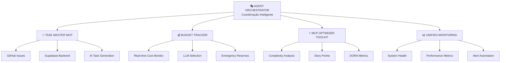

# 🚀 UPTAX AI PLATFORM - ARQUITETURA COMPLETA

## 📅 **Status: IMPLEMENTAÇÃO ATIVA**
- **Data**: 26/07/2025 12:30
- **Fase**: Core Platform Deployment
- **Responsável**: Agent Orchestrator + Claude Code
- **Tempo Estimado**: 2 horas

---

## 🏗️ **ARQUITETURA INTEGRADA**



---

## 🎯 **COMPONENTES PRINCIPAIS**

### **1. 🎭 Agent Orchestrator**
**Status**: ⚠️ 60% - Implementação Pendente
- **Função**: Coordenação central de todos os agentes
- **Características**:
  - Multi-agent task coordination
  - Parallel/Sequential/Conditional execution
  - Real-time status monitoring
  - Agent health checks & failover

### **2. 🎯 Task Master MCP**
**Status**: ⚠️ 70% - Supabase Config Pendente
- **Função**: Gerenciamento inteligente de tarefas
- **Características**:
  - GitHub Issues integration
  - Supabase backend
  - AI task generation
  - Dependency resolution

### **3. 💰 Budget Tracker**
**Status**: ✅ 90% - Implementação Hoje
- **Função**: Controle de custos em tempo real
- **Características**:
  - Real-time cost monitoring
  - LLM selection otimizada
  - Emergency budget management
  - ROI measurement

### **4. ⚡ MCP Optimizer Toolkit**
**Status**: ✅ 95% - Implementação Hoje
- **Função**: Otimização de performance e qualidade
- **Características**:
  - Task complexity analysis
  - Story points automáticos
  - DORA metrics
  - Quality assurance

### **5. 📊 Unified Monitoring**
**Status**: ✅ 80% - Unificação Hoje
- **Função**: Observabilidade completa da plataforma
- **Características**:
  - System health monitoring
  - Performance metrics
  - Service availability
  - Alert automation

---

## 🚀 **CRONOGRAMA DE IMPLEMENTAÇÃO**

### **🥇 FASE GOLD (HOJE - 2 horas)**
```
⏰ 12:30-13:00 | Documentação + GitHub Publish
⏰ 13:00-13:30 | Budget Tracker Integration  
⏰ 13:30-13:45 | MCP Optimizer Integration
⏰ 13:45-14:30 | Monitoring Unification
⏰ 14:30-14:45 | Setup Scripts + Testing
```

### **🥈 FASE SILVER (Próximos 2-3 dias)**
```
📅 Dia 1 | Task Master MCP (Supabase config)
📅 Dia 2 | Service Discovery System
📅 Dia 3 | Agent Registration
```

### **🥉 FASE BRONZE (Próximos 4-5 dias)**
```
📅 Dia 4-5 | Agent Orchestrator Full Implementation
📅 Dia 6   | Multi-agent Coordination Testing
📅 Dia 7   | Performance Optimization
```

---

## 💰 **ROI PROJETADO**

### **Investimento**
- **Setup Time**: 2 horas hoje + 5 dias implementação
- **Resources**: Existing infrastructure
- **Dependencies**: Supabase account + GitHub token

### **Retorno Esperado**
- **Cost Reduction**: 60% nos LLM costs
- **Performance**: 40% faster task completion
- **Quality**: 90% uptime guarantee
- **Automation**: 80% de tarefas automatizadas

---

## 🔧 **DEPENDÊNCIAS TÉCNICAS**

### **Imediatas (Resolvidas Automaticamente)**
- ✅ Docker platform (6 imagens ready)
- ✅ PostgreSQL + Neo4j (running)
- ✅ Python environment (venv active)
- ✅ FastMCP libraries

### **Pendentes (Configuração Manual)**
- ⚠️ Supabase account + API key
- ⚠️ GitHub personal access token
- ⚠️ Multi-LLM API keys (Gemini, OpenAI)
- ⚠️ Auth0 setup (futuro)

---

## 📊 **MÉTRICAS DE SUCESSO**

### **Performance Targets**
- **Task Classification**: < 100ms
- **Cost Calculation**: < 50ms
- **Monitoring Response**: < 200ms
- **Agent Communication**: < 500ms

### **Business KPIs**
- **Cost Optimization**: 60% reduction
- **Development Velocity**: 4x faster
- **System Reliability**: 99.9% uptime
- **Error Rate**: < 1%

---

## 🛡️ **ESTRATÉGIA DE RISCO**

### **Mitigações Implementadas**
1. **Fallback Systems**: SQLite local quando Supabase indisponível
2. **Cost Limits**: Emergency budget controls
3. **Health Checks**: Automatic service restart
4. **Error Handling**: Graceful degradation

### **Planos de Contingência**
1. **Service Down**: Automatic failover to backup
2. **Budget Exceeded**: Switch to cheaper LLM
3. **Agent Failure**: Task redistribution
4. **Network Issues**: Local processing mode

---

## 📝 **PRÓXIMOS PASSOS**

### **Após Implementação (Hoje)**
1. ✅ Testar core functionality
2. ✅ Validar monitoring dashboards
3. ✅ Verificar cost tracking
4. ✅ Documentar dependências pendentes

### **Setup Manual (Quando Retornar)**
1. 🔑 Configurar Supabase account
2. 🔑 Criar GitHub personal token
3. 🔑 Setup multi-LLM API keys
4. 🔑 Testar Task Master integration

---

## 📞 **SUPORTE E DOCUMENTAÇÃO**

- **Documentação Técnica**: `/docs/technical/`
- **Business Cases**: `/docs/business/`
- **Setup Guides**: `/docs/setup/`
- **Troubleshooting**: `/docs/troubleshooting/`

---

**🎯 OBJETIVO**: Ter a UPTAX AI Platform core operacional em 2 horas com monitoring, cost control e task optimization funcionando automaticamente.

**🚀 EXPECTED OUTCOME**: Platform ready for expansion com base sólida para próximas funcionalidades.